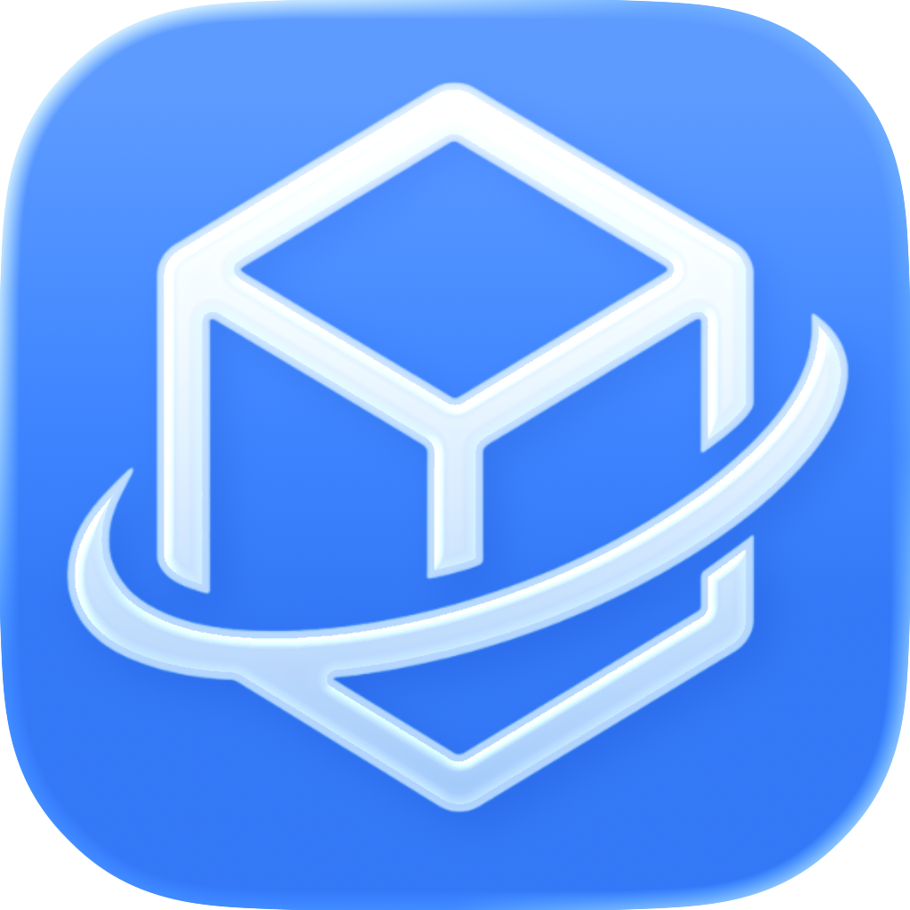

<div align="center">
  
  <h1>ipaverse</h1>
  <p>Download, re-sign, and sideload iOS apps — without Xcode or Terminal.</p>

[](https://developer.apple.com/macos/)
[](https://developer.apple.com/xcode/swiftui/)

</div>

---

## Features

- Search the App Store and download IPA files
- Browse full version history for any app
- Re-sign IPAs with your own developer certificate
- Install directly to a connected iPhone/iPad over USB
- Manage multiple Apple IDs with Keychain storage
- Switch storefronts across regions

> **Note:** Re-signing and installation only works with DRM-free IPAs. Most free apps qualify — paid apps are typically FairPlay-encrypted.

---

## Demo

### Download


### Re-sign IPA


### Install to Device


### Switch Account


### Change Storefront


---

## Installation

```bash
brew install --cask ipaverse
```

Or build from source:

```bash
git clone https://github.com/bahattinkoc/ipaverse.git
cd ipaverse
open ipaverse.xcodeproj
```

---

**Made with ❤️**
